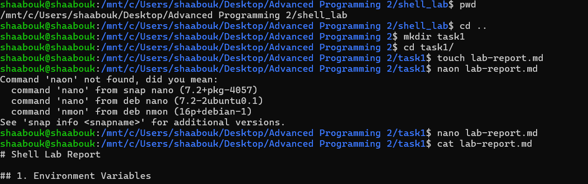
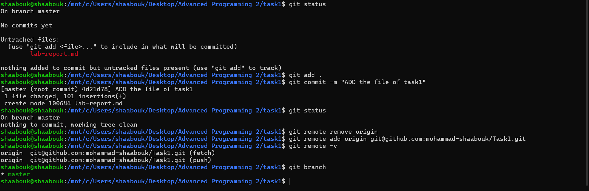
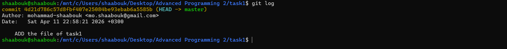
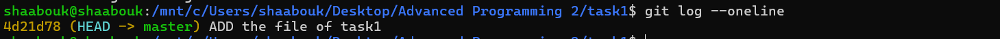

# Shell Lab Report

## Important Commands :
- pwd
- ls
- ls -la
- cd
- mkdir
- cp
- mv
- rm
- cat
- head -n
- tail -n
- grep
- printf
- wc
- echo
- source
- ecport
- cat
- cut

## 1. Environment Variables

- COURSE=UnixShell
- echo $COURSE 
- echo $HOME
- echo $PATH

---

## 2. Initialization Files

- .bashrc  
- alias ll='ls -lah'
- source ~/.bashrc
---

## 3. Text Processing

- wc file
- grep admin file
- head -n 3
- tail -n 2
- tr 'a-z' 'A-Z'
- cut -d ',' -f 1

---

## 4. Bash Script

- greet.sh  
- ./greet.sh Ahmad

---

## 5. Git

- git init  
- git add .  
- git commit -m "message"  
- git log --oneline  

---

## 6. Short Assessment Questions
#4: Short Assessment Questions
1. What is the difference between `>`, `>>`, and `&>`?

- `>`: Redirects standard output (stdout) to a file, with a new overwrite.

- `>>`: Redirects standard output to a file, with an append.

- `&>`: Redirects standard output + error messages (stdout + stderr) to a file.

2. When do we use `source` instead of `./script.sh`?

- We use `source script.sh` to run the script in the same session (current shell), so that variables and functions remain defined after execution.

- `./script.sh`, on the other hand, runs the script in a new process (subshell), and variables are lost after execution.

3. What is the difference between `&&` and `||`?

- `&&`: Executes only the second command if the first one succeeds.

- ||`: Executes only the second command if the first one fails. 4. Why do we use branches in Git?

- To separate development and testing without affecting the stable release.

- To facilitate teamwork, review modifications, and safely test new features.

5. What is the function of `ssh-agent`?

- To manage the user's SSH keys.

- To allow caching of key passwords to avoid having to enter them every time you connect to the servers.

## Screenshots 

### Git Log

